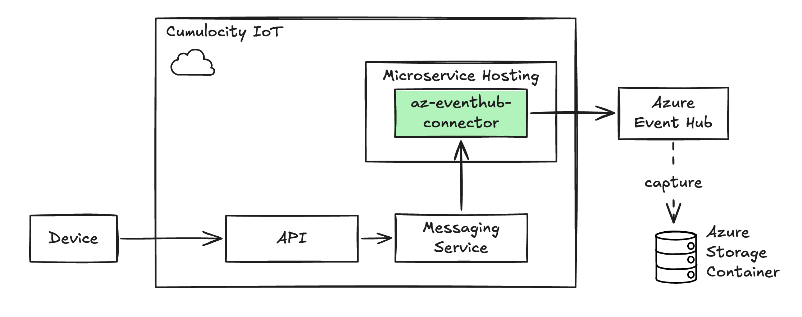

# About

This project is a Cumulocity Microservice that listens to all Events created in a Cumulocity Tenant. On arrival, these Events are sent to an Azure Event Hub data stream. 

# Prerequisites

Following prerequisites apply for this Service:

* Have a Cumulocity Tenant with the `feature-microservice-hosting` enabled

* Have at least one Azure Event Hub (you will need the name and SAS Token)

* Have the following tenant credentials set:

|Category|Key|Value|Optional/Mandatory|
|--|--|--|--|
|az-eventhub-connector|c8y-device-id|The device id the service should produce sample events to|optional|
|az-eventhub-connector|credentials.az-connection-string|The connection string for your Event Hub (this value will be encrypted by Cumulocity)|mandatory|
|az-eventhub-connector|az-eventhub-name|Name of your Azure Event Hub (w/o namespace prefix)|mandatory|

# Build and Deploy

You can use the `justfile` (see [just](https://github.com/casey/just)) in projects root directory to build the Service to a Docker image and upload to Cumulocity. The justfile is using the [Cumulocity CLI](https://goc8ycli.netlify.app/docs/introduction/) for deploying the Service to the platform. 