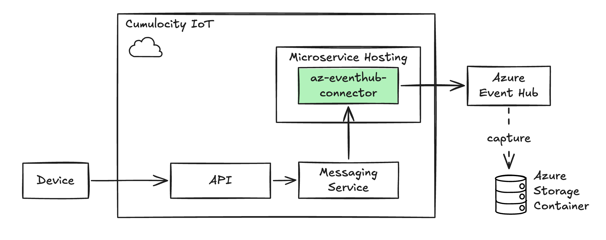

# About

This project is a Cumulocity Microservice that listens to all Events created in a Cumulocity Tenant via the [Notification 2.0](https://cumulocity.com/api/core/#tag/About-notifications-2.0) API. On arrival, these Events are sent to an Azure Event Hub data stream. 



# Prerequisites

Following prerequisites apply for this Service:

* Have a Cumulocity Tenant with the `feature-microservice-hosting` enabled

* Have at least one Azure Event Hub (you will need the name and SAS Token)

* Have Managed Objects in your tenant that match the query stated in `subscription.inventoryQuery` within `config.toml` file (see also Q&A section)

* Have the following tenant options set:

|Category|Key|Value|Optional/Mandatory|
|--|--|--|--|
|azEventHubConnector|credentials.connectionString|The [connection string]((https://learn.microsoft.com/en-us/azure/event-hubs/event-hubs-get-connection-string)) for your Event Hub (this value will be encrypted by Cumulocity)<br><br>Note: Connection String looks like `Endpoint=sb://your-eventhub-namespace.servicebus.windows.net/;SharedAccessKeyName=<your-sas-policy>;SharedAccessKey=<your-access-key>`, remove the `;EntityPath=xxx` suffix if existing|mandatory|
|azEventHubConnector|eventHubName|Name of your Azure Event Hub (w/o namespace prefix)|mandatory|

A convenient way to manage these tenant options is via [CLI](https://goc8ycli.netlify.app/docs/introduction/):

```sh
$ c8y tenantoptions create --category azEventHubConnector --key "eventHubName" --value "your-event-hub-name" -f
$ c8y tenantoptions create --category azEventHubConnector --key "credentials.connectionString" --value "Endpoint=sb://..." -f
```

# Build and Deploy

You can use the `justfile` (see [just](https://github.com/casey/just)) in projects root directory to build the Service to a Docker image and upload to Cumulocity. The justfile is using the [Cumulocity CLI](https://goc8ycli.netlify.app/docs/introduction/) for deploying the Service to the platform. The easiest way to build and deploy the Service is via `just build-and-deploy-c8y`. 

If you do not have these tools available, no problem. The justfile is just a shell-script wrapper, so you can see in justfile the steps needed to build the project manually. For uploading towards Cumulocity you can also use the UI or [(Application-)API](https://cumulocity.com/api/core/). 

# API

The exposed API endpoints of the service are:

```sh
# returns up status when running
$ curl -X GET -H "Accept: application/json" http://localhost:80/health

# can be used to scrape service metrics via Prometheus
$ curl -X GET http://localhost:80/metrics

# stops the service immediately (can be handy when running Kubernetes to fore a restart)
$ curl -X POST -H "Accept: text/plain" http://localhost:80/kill
```

When running in Cumulocity, the base-url will be `https://<your-tenant-domain>/service/az-eventhub-connector/` without stating the port, e.g. `https://my-tenant.cumulocity.com/service/az-eventhub-connector/health`. 

# Configuration

Have a look at the `config.toml` file in projects root directory. You can place this file in any of these locations in order to be applied: `.`: the same directory where also your executable is located, `/etc/az-eventhub-connector` or `/$HOME/.az-eventhub-connector`. 

The config file is optional, if none is provided, sensible defaults will be applied. In addition to config file, you _need_ to have the tenant options set as stated in Prerequisites section.

# Q & A

```
How can I define for which Managed Objects (Devices) data is forwarded?
```

The service queries periodically for all Objects that should be part of the live-data subscription, but isn't yet. Every object hitting this query will be added to the live-subscription automatically.

The query that is used to find these "should have subscription but have not yet" objects is configurable via the `subscription.inventory_query` setting in `config.toml`. By default the service adds all Managed Objects with the fragment `fwdToAzureEventHub` to the Subscription. 

> To have Measurements for all Devices forwarded the query should be `has(c8y_IsDevice) and not has(azureNotificationSubscription)`. 

```
How long does it take from data-receival in Cumulocity until it is forwarded to my Event Hub?
```
TLDR: this is configurable, by default you can expect < 3 seconds.

The Service receives a notification about newly received measurements immediately. Once received, the Service implements real-time batching with fixed time windows. This means it bundles all measurements until either a fixed batch size or a fixed time window is reached. Both (max. batch size and max. time window) is configurable in the `config.toml` file. By default, max. time-window is configured to be 1 second.


```
When adding a new Device, how long will it take until it is registered to the live-subscription
```

This is configurable via the `subscription.sync_cron` element in `config.toml`. By default, the service checks every 5 Minutes for new Managed Objects.

```
I have very high throughput demands, how can I scale up/down the Service?
```

Two ways to scale up/down:
* Horizontal: the amount of workers for in- and outbound processing is freely configurable within `config.toml`

* Vertical: When running within Cumulocity, the service is allowed to use the resources configured in `cumulocity.json` file. Adapt these values if you need more or less resources for the Service.

```
What will happen when the service is down, will it miss to forward all messages that were received by the platform during service downtime?
```

No. The service is using persisted Notification2 subscriptions. This ensures all data that wasn't received/acknowledged by the Service will be buffered and sent on next successful connect of the Service. For more info have a read [here](https://cumulocity.com/api/core/#tag/About-notifications-2.0)

# Open points / Future Extensions

* Move the service from `PER_TENANT` to `MULTI_TENANT` scope. This will allow the service to run once and serve multiple tenants in parallel. 

* Currently the configuration file is copied into the docker image while building. In future, the configuration file will be externalized (likely via tenant options) so that re-configuration does not need a new docker image.

* Setup of Github-/Release workflow so that the built artifacts can be downloaded directly from the Github project

* Usage of (shared consumers)[https://cumulocity.com/api/core/#section/Overview/Shared-consumer-tokens]. This will not only allow to scale up/down workers for the live-data pipeline but also to have multiple, parallel live-data pipelines (potentially interesting for use cases with very high throughput requirements)